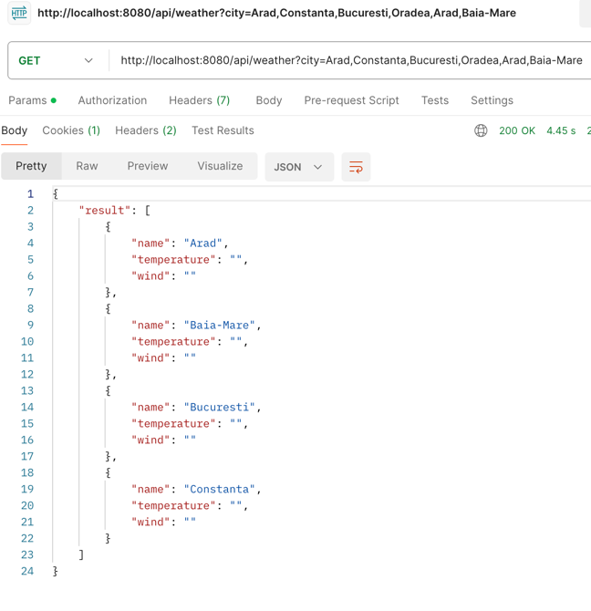
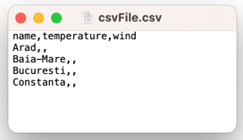

# WEATHER APPLICATION

# Functionalities:
* Expose /api/weather endpoint with list of cities as a query parameter
* Remove the cities from the list for which the weather forecast request won't be made
* Retrieve weather information for each city using Api calls, in case of no data found for a city, the temperature and wind fields will be empty
* Calculate average temperature and wind speed for each city 
* Order alphabetically by city name
* Create a .csv file and write the results in it
* Return result data to /api/weather endpoint

### Example
* Api call
  http://localhost:8080/api/weather?city=Arad,Constanta,Bucuresti,Baia-Mare
* Return

* Temperature and wind fields are empty because there is a server calls limit that was reached
*  https://998d8129-2264-4a98-a92e-ba8bde4a4d1c.mock.pstmn.io/Arad
{"error":{"name":"usageLimitError","header":"Usage limit reached","message":"Your team plan allows 1000 mock server calls per month. Contact your team Admin to up your limit."}}

